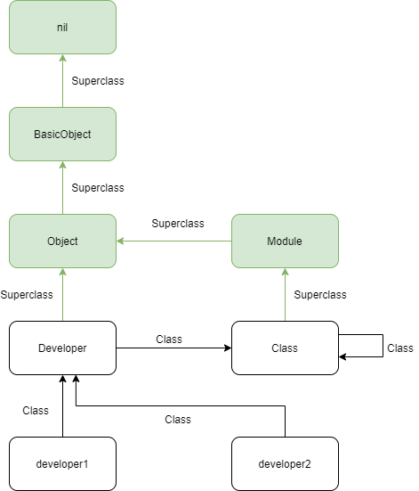

# Ruby Metaprogramming

## References

[ruby-metaprogramming](https://www.toptal.com/ruby/ruby-metaprogramming-cooler-than-it-sounds)

## Basic

[ruby_class_basic.rb](src/ruby_class_basic.rb)



结合上图以及上面的代码我们可以知道：

```ruby
# #<Developer:0x00005585d8416140>.class is Developer
# Developer.class is Class
# Class.class is Class
# Module.class is Class
# Object.class is Class
# BasicObject.class is Class

# Developer.superclass is Object
# Class.superclass is Module
# Module.superclass is Object
# Object.superclass is BasicObject
# BasicObject.superclass is nil
```

在 ruby 中，所有的自定义类以及 Class / Module / Object / BasicObject 都是 Class 的实例对象。

Class 的父类为 Module ，Module 不能实例化对象，Class 是可以的。
