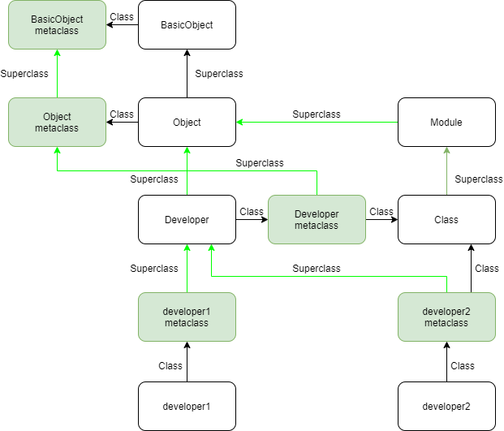

# Ruby Metaprogramming

## References

[ruby-metaprogramming](https://www.toptal.com/ruby/ruby-metaprogramming-cooler-than-it-sounds)

[Metaprogramming in Ruby](http://ruby-metaprogramming.rubylearning.com/html/ruby_metaprogramming_2.html)

## Metaclass of String

[ruby_metaclass_string.rb](src/ruby_metaclass_string.rb)

我们给 String hello_world 定义了两个新方法 upcase0 / reverse0 ，我们可以通过 hello_world 来调用这两个方法，但是其他的 String other_string 却不能调用这个方法。说明这两个新方法并不是 String 的实例方法。

同时对于 hello_world 来说，这个两个新方法其实就是该对象的类方法，因为我们可以通过 hello_world 来直接调用。

这两个新方法本质就是定义在 hello_world 的 metaclass 中的实例方法。

## Metaclass

[ruby_metaclass_developer.rb](src/ruby_metaclass_developer.rb)

从上述代码可以看出，类方法其实可以看作是该类的 metaclass 的实例方法。

对于普通对象而言，其能够调用的方法就是其对应的 metaclass 以及其对应的 class 的实例方法。

对于类而言，类可以看作是一种特殊的对象，其能够调用的方法就是其对应的 metaclass 以及其对应的 class 的实例方法。

无论是实例还是类，我们通过 metaclass 将其对应的方法都定义成了相应的实例方法。



从上图可以看出，一个对象 developer1 并非直接由 Developer 实例化而来，而是由 Developer 派生的子类 developer1 metaclass 实例化而来。

## Method Lookup

针对任意一个 obj 的 method lookup 有一个规律：one step to the right, then up 。这句话的意思就是，先找到该 obj 对应的 class ，然后再查找其 class 对应 ancestors ，直到找到该方法。我们拿 class Developer 来举例，应该要从下面这些类中去查找对应的方法。

```ruby
Developer.class.ancestors
# [Class, Module, Object, Kernel, BasicObject]
```

但是，我们还需要记住一点，那就是 ruby 中的 singleton_class ，所以真正正确的查找应该是先找到 Developer 的 singleton_class ，然后查找其对应的 ancestors 。

```ruby
Developer.singleton_class.ancestors.inspect
# [#<Class:Developer>, #<Class:Object>, #<Class:BasicObject>, Class, Module, Object, Kernel, BasicObject]
```

下面两份代码很好的诠释了如何去查找任意 obj 的 method look up 。

[类对象的 method lookup](src/ruby_method_lookup_class.rb)

[普通对象的 method lookup](src/ruby_method_lookup_obj.rb)

## Useful Methods in Ruby Metaprogramming

- class / instance_methods / instance_variables / respond_to?

[ruby_reflection.rb](src/ruby_reflection.rb)

- send

send 方法可以用来调用其他方法。send 的第 1 个参数就是被调用的方法名，可以用 String / Symbol ，最好是使用 Symbol 。

send 方法还能够调用 private 方法。在元编程中很多时候会使用 send 来调用一些 private 方法。

[ruby_send.rb](src/ruby_send.rb)

- define_method

[ruby_def_define.md](ruby_def_define.md)

- method_missing

- remove_method / undef_method

[ruby_remove_undef.rb](src/ruby_remove_undef.rb)

remove_method 会将定义在当前类中的 method 移除，如果 method 不存在，该方法会报错。

undef_method 会阻止该类的任何对象调用该方法。如果 method 不存在，该方法也不会报错。

在 undef_method 之后，如果我们重新 define method ，是可以重新调用该方法的。
